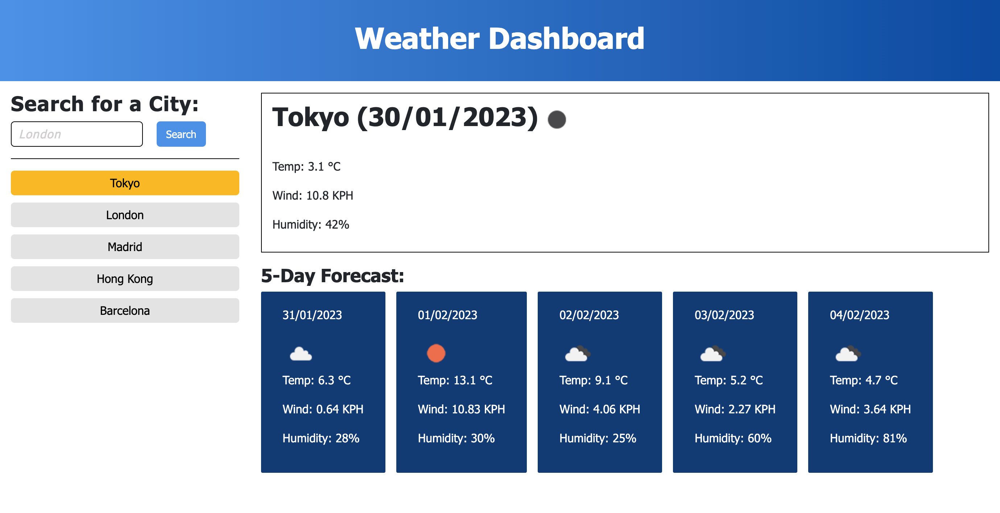

# challenge8-Weather-Dashboard

# Description 
> In challenge 8 I created  a weather dashboard applicaiton showing current and future conditions for a city and the city is added to the search history.

## Usage 
To access the solution open the below link to deployed application.
* Deployed application - [https://marzena-w.github.io/challenge8-Weather-Dashboard/]
* search city you want to check weather for
* Click Search button on the right
* Screenshot of the challenge8:

## Credits

* Openweather - [https://openweathermap.org/forecast5]
* How to display icon - [https://stackoverflow.com/questions/44177417/how-to-display-openweathermap-weather-icon]
* momentjs - [https://momentjs.com/docs/#/displaying/]
* To see website updates - Live Server - [https://marketplace.visualstudio.com/items?itemName=ritwickdey.LiveServer]

## License
MIT